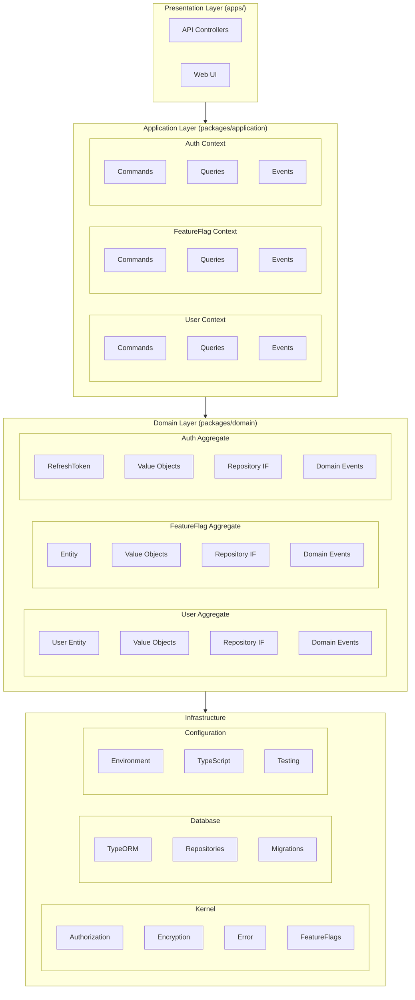
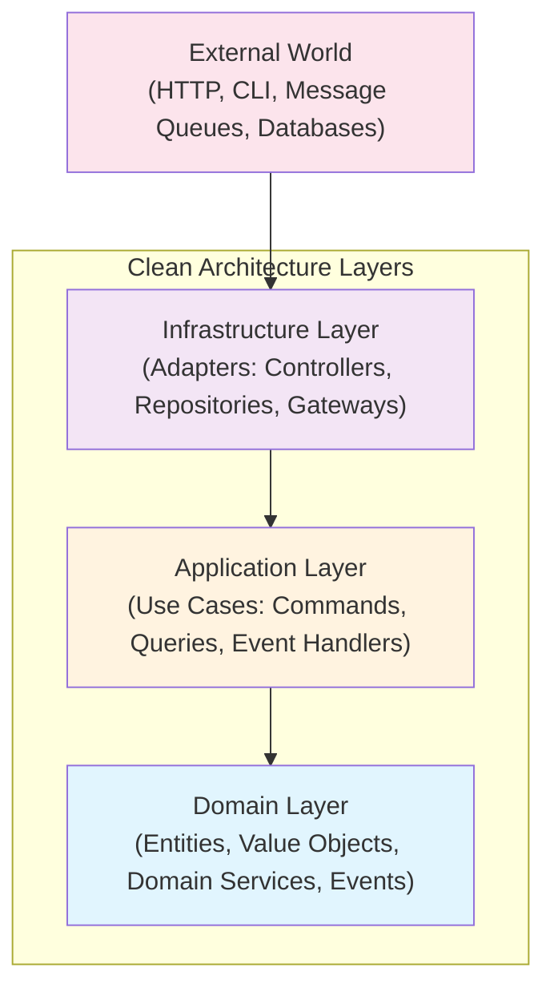
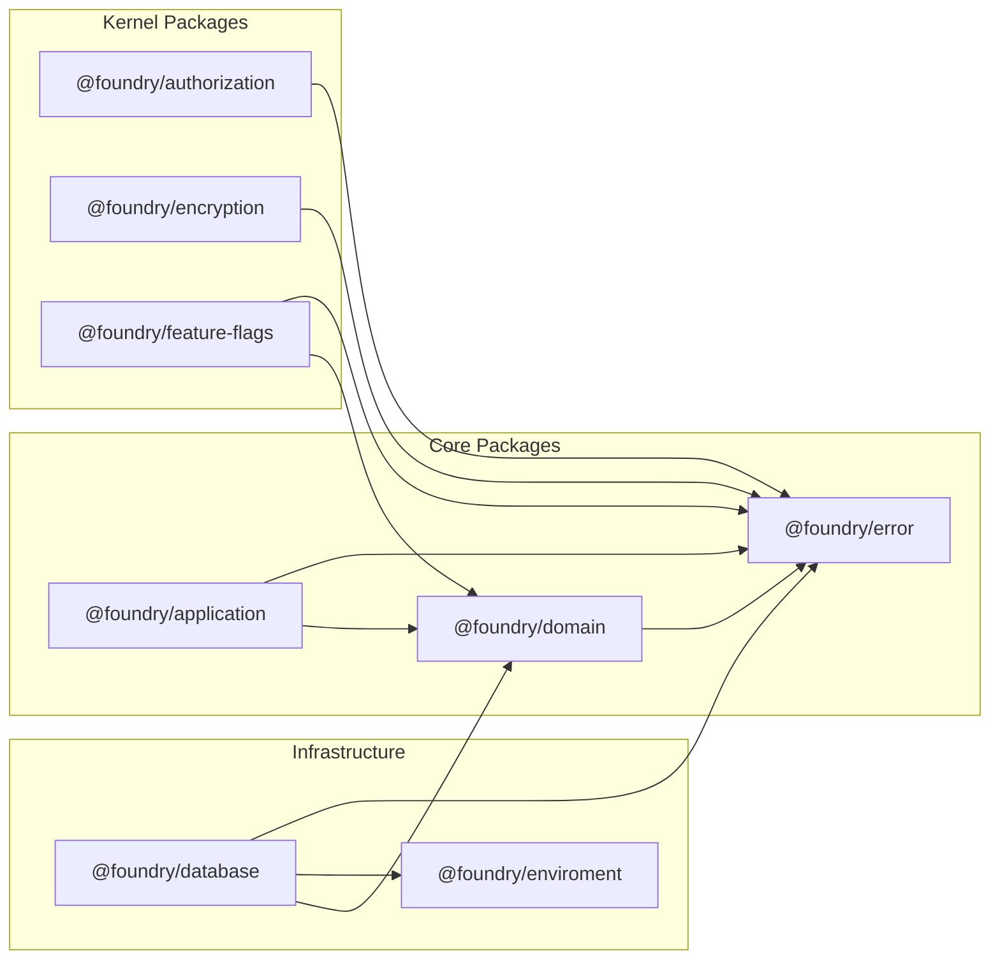
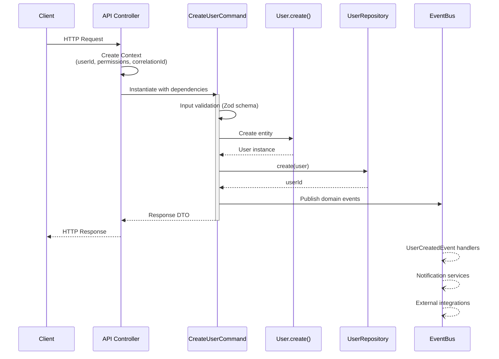

# Architecture Overview

Foundry is an enterprise-grade TypeScript monorepo implementing **Domain-Driven Design (DDD)**, **Hexagonal Architecture (Ports & Adapters)**, and **CQRS (Command Query Responsibility Segregation)** patterns.

## High-Level Architecture



## Core Design Principles

### 1. Hexagonal Architecture (Ports & Adapters)

The system is designed around the concept of ports (interfaces) and adapters (implementations):

- **Ports**: Repository interfaces, event bus interfaces, service contracts
- **Adapters**: Database implementations, message queue implementations, external service integrations

This allows the core business logic to remain independent of infrastructure concerns.

### 2. CQRS (Command Query Responsibility Segregation)

The application layer strictly separates:

- **Commands**: State-changing operations (CreateUser, UpdateUser, DeleteUser)
- **Queries**: Read-only operations (GetUserById, ListUsers)
- **Events**: Notifications of state changes (UserCreated, UserUpdated)

Benefits:
- Independent scaling of read and write workloads
- Optimized query models for different use cases
- Clear audit trails through event sourcing

### 3. Domain-Driven Design (DDD)

#### Bounded Contexts

The system is organized into bounded contexts, each with its own:
- Aggregate roots
- Entities and value objects
- Repository interfaces
- Domain events
- Domain services

Current bounded contexts:
- **User**: User management and lifecycle
- **FeatureFlag**: Feature toggle management with A/B testing
- **Auth**: Authentication, refresh token management, and SSO integration

#### Aggregate Pattern

Each aggregate root:
- Encapsulates domain logic and invariants
- Produces domain events for state changes
- Is the only entry point for modifications
- Maintains consistency within its boundary

### 4. Clean Architecture Layers



**Dependency Rule**: Dependencies only point inward. The domain layer has no dependencies on outer layers.

## Package Dependencies



## Data Flow Example

### Creating a User



## Cross-Cutting Concerns

### Authorization
Implemented via the `@foundry/authorization` kernel package:
- RBAC (Role-Based Access Control)
- ABAC (Attribute-Based Access Control)
- Multi-tenant support
- Field-level permissions

### Encryption
Implemented via the `@foundry/encryption` kernel package:
- Multiple encryption algorithms (AES-256-GCM, ChaCha20)
- Key management and rotation
- Searchable encryption
- Compliance audit trails (GDPR, LGPD, CCPA)

### Feature Flags
Implemented via the `@foundry/feature-flags` kernel package:
- A/B testing with variants
- User segmentation
- Percentage rollouts
- Time-based scheduling

### Error Handling
Standardized via the `@foundry/error` kernel package:
- Structured error types
- Error codes and metadata
- Package-level error context

## Monorepo Structure

```
foundry/
├── apps/                    # Deployable applications
│   └── lambdas/             # AWS Lambda APIs
│       ├── auth/            # Authentication API
│       ├── user/            # User management API
│       └── feature-flag/    # Feature flag API
├── packages/                # Core business packages
│   ├── application/         # Use cases (CQRS)
│   └── domain/              # Domain model (DDD)
├── kernel/                  # Shared infrastructure
│   ├── authorization/       # Access control
│   ├── encryption/          # Data protection
│   ├── error/               # Error handling
│   ├── feature-flags/       # Feature management
│   ├── logger/              # Structured logging
│   └── testing/             # Test utilities and in-memory repositories
├── infra/                   # Infrastructure adapters
│   └── database/            # PostgreSQL + TypeORM
├── config/                  # Shared configurations
│   ├── enviroment/          # Environment management
│   ├── typescript-config/   # TypeScript settings
│   └── vitest-config/       # Testing configuration
├── tools/                   # Development tools
└── scripts/                 # Build and deployment scripts
```

## Build System

The monorepo uses:
- **Turbo**: Task orchestration and caching
- **Yarn 4 (Berry)**: Package management with workspaces
- **tsdown**: Fast TypeScript bundling
- **Biome**: Linting and formatting
- **Vitest**: Testing framework

## Key Design Decisions

| Decision | Rationale |
|----------|-----------|
| Monorepo | Shared code, atomic changes, consistent tooling |
| TypeScript | Type safety, better IDE support, refactoring confidence |
| CQRS | Separation of concerns, scalable read/write paths |
| DDD | Business logic encapsulation, ubiquitous language |
| Hexagonal | Infrastructure independence, testability |
| Event-Driven | Loose coupling, eventual consistency, audit trails |
| Zod | Runtime validation, TypeScript integration |
