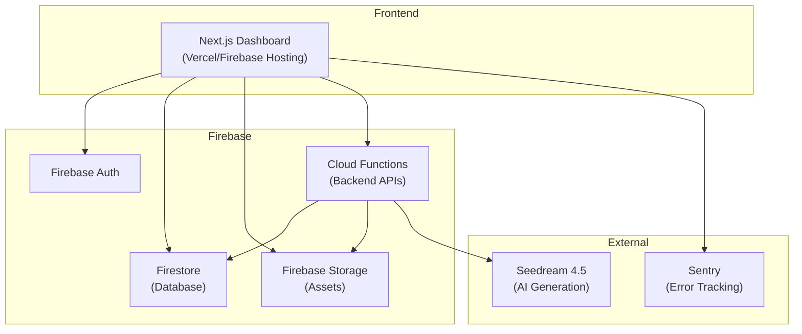

# Deployment Infrastructure

Firebase infrastructure for deploying EchoModel.

## Overview

| Property | Value |
|----------|-------|
| Platform | Firebase |
| Location | `infra/firebase` |
| Purpose | Cloud infrastructure configuration |
| Services | Firestore, Firebase Storage, Cloud Functions, Firebase Auth |

## Architecture



## Firebase Configuration

Configuration files in `infra/firebase/`:

| File | Purpose |
|------|---------|
| `firebase.json` | Project configuration |
| `firestore.rules` | Firestore security rules |
| `firestore.indexes.json` | Firestore indexes |
| `storage.rules` | Firebase Storage security rules |
| `.firebaserc` | Project aliases |

## Deployment Commands

```bash
# Deploy all Firebase services
firebase deploy

# Deploy only Firestore rules
firebase deploy --only firestore:rules

# Deploy only Storage rules
firebase deploy --only storage

# Deploy only Cloud Functions
firebase deploy --only functions

# Deploy to specific project
firebase deploy --project production
```

## Environment Configuration

### Firebase Project Setup

1. Create Firebase project in [Firebase Console](https://console.firebase.google.com)
2. Enable required services:
   - Authentication (Email/Password, Google)
   - Firestore Database
   - Firebase Storage
3. Generate service account key for backend operations

### Environment Variables

Dashboard app (`apps/dashboard/.env.local`):

```bash
# Firebase
NEXT_PUBLIC_FIREBASE_API_KEY=your-api-key
NEXT_PUBLIC_FIREBASE_AUTH_DOMAIN=your-project.firebaseapp.com
NEXT_PUBLIC_FIREBASE_PROJECT_ID=your-project-id
NEXT_PUBLIC_FIREBASE_STORAGE_BUCKET=your-project.appspot.com
NEXT_PUBLIC_FIREBASE_MESSAGING_SENDER_ID=your-sender-id
NEXT_PUBLIC_FIREBASE_APP_ID=your-app-id

# Sentry
NEXT_PUBLIC_SENTRY_DSN=your-sentry-dsn
SENTRY_AUTH_TOKEN=your-sentry-auth-token
```

## Security Rules

### Firestore Rules

```javascript
// infra/firebase/firestore.rules
rules_version = '2';
service cloud.firestore {
  match /databases/{database}/documents {
    // Users can only access their own data
    match /users/{userId} {
      allow read, write: if request.auth != null && request.auth.uid == userId;
    }

    // Store data is scoped to authenticated users
    match /stores/{storeId} {
      allow read, write: if request.auth != null;
    }
  }
}
```

### Storage Rules

```javascript
// infra/firebase/storage.rules
rules_version = '2';
service firebase.storage {
  match /b/{bucket}/o {
    match /users/{userId}/{allPaths=**} {
      allow read, write: if request.auth != null && request.auth.uid == userId;
    }
  }
}
```

## CI/CD Integration

### GitHub Actions

Deployment triggered on:
- Push to `main` → Production
- Push to `staging` → Staging
- Manual dispatch → Any environment

### Required Secrets

| Secret | Description |
|--------|-------------|
| `FIREBASE_TOKEN` | Firebase CLI token for deployment |
| `FIREBASE_SERVICE_ACCOUNT` | Service account JSON for backend |
| `SENTRY_AUTH_TOKEN` | Sentry release tracking |
| `VERCEL_TOKEN` | Vercel deployment (if using Vercel) |

## Monitoring

### Sentry Integration

Error tracking configured in:
- `apps/dashboard/sentry.client.config.ts`
- `apps/dashboard/sentry.server.config.ts`
- `apps/dashboard/sentry.edge.config.ts`

### Firebase Console

Monitor in [Firebase Console](https://console.firebase.google.com):
- Authentication usage
- Firestore reads/writes
- Storage bandwidth
- Cloud Functions invocations
