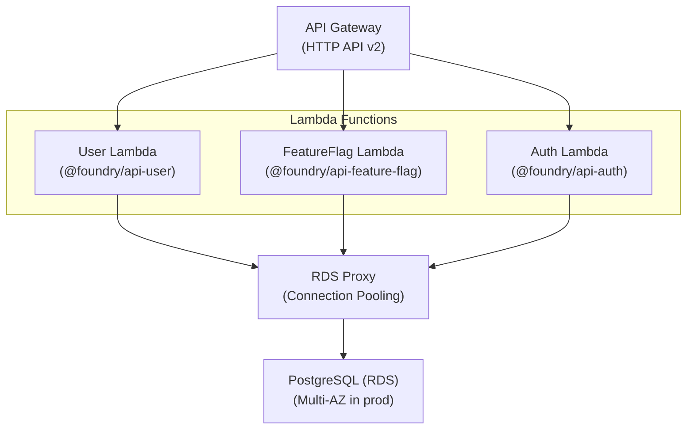

# Deployment Infrastructure (@foundry/cdk)

AWS CDK infrastructure for deploying Foundry to AWS with support for local development via LocalStack.

## Overview

| Property | Value |
|----------|-------|
| Package | `@foundry/cdk` |
| Location | `infra/cdk` |
| Purpose | Infrastructure as Code (IaC) |
| Dependencies | `aws-cdk-lib`, `@foundry/api-user`, `@foundry/api-feature-flag` |

## Architecture



## Environments

| Environment | VPC CIDR | Database | Lambda Memory | API Throttling |
|-------------|----------|----------|---------------|----------------|
| `dev` | 10.0.0.0/16 | t4g.micro, 20GB | 256MB | 100 req/s |
| `staging` | 10.1.0.0/16 | t4g.small, 50GB | 512MB | 500 req/s |
| `prod` | 10.2.0.0/16 | Configurable, Multi-AZ | 1024MB | Configurable |

## CDK Stacks

### Production Stacks

```
infra/cdk/lib/stacks/
├── network-stack.ts        # VPC, NAT, Subnets
├── database-stack.ts       # RDS PostgreSQL, Proxy, Secrets
├── lambda-stack.ts         # Lambda functions
└── api-gateway-stack.ts    # HTTP API Gateway
```

### LocalStack Stacks

```
infra/cdk/lib/stacks/
├── lambda-stack-local.ts       # Simplified Lambda (no VPC)
└── api-gateway-stack-local.ts  # Simplified API Gateway
```

## Package Resolution

Lambda code paths are resolved using Turborepo package references:

```typescript
// infra/cdk/lib/utils/package-resolver.ts
import { createRequire } from 'node:module'

export const LambdaPackages = {
  USER: '@foundry/api-user',
  FEATURE_FLAG: '@foundry/api-feature-flag',
} as const

export function getLambdaCodePath(packageName: LambdaPackageName): string {
  const require = createRequire(import.meta.url)
  const packageJsonPath = require.resolve(`${packageName}/package.json`)
  return join(dirname(packageJsonPath), 'dist')
}
```

This approach:
- Respects Turborepo dependency graph
- Ensures packages build before CDK deployment
- Works regardless of file structure changes
- Provides clear error messages if packages aren't built

## Deployment Commands

### Production/Staging

```bash
# Deploy to development
yarn workspace @foundry/cdk run deploy:dev

# Deploy to staging
yarn workspace @foundry/cdk run deploy:staging

# Deploy to production
yarn workspace @foundry/cdk run deploy:prod

# Preview changes
yarn workspace @foundry/cdk run diff

# Synthesize CloudFormation (dry run)
yarn workspace @foundry/cdk run synth
```

### LocalStack

```bash
# Bootstrap CDK for LocalStack
yarn cdk:local:bootstrap

# Deploy to LocalStack
yarn cdk:local:deploy

# Destroy LocalStack stacks
yarn cdk:local:destroy

# Synthesize CloudFormation for LocalStack
yarn cdk:local:synth
```

## Lambda Configuration

### BoundedContextLambda Construct

Reusable construct for Lambda functions:

```typescript
import { BoundedContextLambda } from '../constructs/bounded-context-lambda.js'

this.userLambda = new BoundedContextLambda(this, 'UserLambda', {
  config,
  boundedContext: 'user',
  description: 'User bounded context Lambda',
  codePath: getUserLambdaCodePath(),  // Package-based resolution
  vpc,
  securityGroup: lambdaSecurityGroup,
  databaseProxy,
  databaseSecret,
})
```

### Lambda Environment Variables

| Variable | Description |
|----------|-------------|
| `NODE_ENV` | `development` or `production` |
| `LOG_LEVEL` | `debug` (dev) or `info` (prod) |
| `DB_PROXY_ENDPOINT` | RDS Proxy endpoint |
| `DB_SECRET_ARN` | Secrets Manager ARN for DB credentials |
| `DB_NAME` | Database name |
| `BOUNDED_CONTEXT` | Context identifier (user, feature-flag) |

## API Gateway Routes

### User API

| Method | Path | Handler |
|--------|------|---------|
| GET | `/users` | List users |
| POST | `/users` | Create user |
| GET | `/users/{id}` | Get user by ID |
| PUT | `/users/{id}` | Update user |
| DELETE | `/users/{id}` | Delete user |
| GET | `/users/health` | Health check |
| GET | `/users/live` | Liveness probe |
| GET | `/users/ready` | Readiness probe |

### Feature Flag API

| Method | Path | Handler |
|--------|------|---------|
| GET | `/feature-flags` | List flags |
| POST | `/feature-flags` | Create flag |
| GET | `/feature-flags/{key}` | Get flag by key |
| POST | `/feature-flags/{key}/enable` | Enable flag |
| POST | `/feature-flags/{key}/disable` | Disable flag |
| POST | `/feature-flags/{key}/evaluate` | Evaluate flag |
| GET | `/feature-flags/health` | Health check |

### Documentation Routes (non-prod only)

| Method | Path | Description |
|--------|------|-------------|
| GET | `/docs` | Swagger UI |
| GET | `/openapi.json` | OpenAPI specification |

## Secrets Management

### Production

Database credentials stored in AWS Secrets Manager:

```json
{
  "host": "rds-proxy-endpoint.amazonaws.com",
  "port": 5432,
  "username": "foundry_admin",
  "password": "****",
  "database": "foundry"
}
```

Lambda retrieves credentials during cold start:

```typescript
// packages/lambda/src/database/dataSourceFactory.ts
export async function getDatabaseConfig(): Promise<DatabaseEnvConfig> {
  const secretArn = process.env.DB_SECRET_ARN

  if (isLambda() && secretArn) {
    const credentials = await getDatabaseCredentials(secretArn)
    return {
      host: credentials.host,
      port: credentials.port,
      // ...
    }
  }

  return getDatabaseEnvConfig()  // Fallback to env vars
}
```

### LocalStack

Secrets created by Docker init script:

```bash
# infra/docker/init-scripts/01-create-secrets.sh
awslocal secretsmanager create-secret \
  --name "local/foundry/database" \
  --secret-string '{
    "host": "host.docker.internal",
    "port": 5432,
    "username": "dev_local",
    "password": "dev_local",
    "database": "dev_local"
  }'
```

## CI/CD Integration

### GitHub Actions

Deployment triggered on:
- Push to `main` → Production
- Push to `staging` → Staging
- Manual dispatch → Any environment

```yaml
# .github/workflows/cd.yml
- name: Deploy Infrastructure
  run: |
    yarn cdk:deploy:${{ env.ENVIRONMENT }}
```

### Required Secrets

| Secret | Description |
|--------|-------------|
| `AWS_ACCESS_KEY_ID_STAGING` | AWS credentials for staging |
| `AWS_ACCESS_KEY_ID_PRODUCTION` | AWS credentials for production |
| `AWS_SECRET_ACCESS_KEY_STAGING` | AWS secret for staging |
| `AWS_SECRET_ACCESS_KEY_PRODUCTION` | AWS secret for production |
| `AWS_ACCOUNT_ID_STAGING` | AWS account ID for staging |
| `AWS_ACCOUNT_ID_PRODUCTION` | AWS account ID for production |
| `GITHUB_TOKEN` | Auto-provided by GitHub Actions |
| `NPM_TOKEN` | For private package access (if needed) |
| `SLACK_WEBHOOK_URL` | Deployment notifications |
| `FIREBASE_TOKEN` | Web app deployment (if using Firebase) |
| `SENTRY_AUTH_TOKEN` | Error tracking (optional) |

### Required Repository Variables

Configure these in **GitHub Settings → Variables → Repository variables**:

| Variable | Description | Example |
|----------|-------------|---------|
| `PRODUCTION_URL` | Production environment URL | `https://foundry.com` |
| `STAGING_URL` | Staging environment URL | `https://staging.foundry.com` |
| `TURBO_TEAM` | Turborepo remote cache team | `foundry` |
| `SENTRY_ORG` | Sentry organization (optional) | `foundry` |
| `SENTRY_PROJECT` | Sentry project (optional) | `foundry-api` |

### Environment Protection Rules

Configure GitHub Environment protection for production safety:

**Steps to configure:**

1. Go to **GitHub → Settings → Environments**
2. Create or edit the `production` environment
3. Configure:
   - **Required reviewers**: Add 2+ team members
   - **Wait timer**: 10 minutes (optional)
   - **Deployment branches**: Restrict to `main` only
   - **Allow administrators to bypass**: Unchecked for max safety

**Protection workflow:**
```
Push to main → CI runs → Pre-deployment checks →
⏸️ Approval required → Reviewers approve → Deploy to production
```

### Deployment Windows

Production deployments are restricted to:
- **Days**: Monday - Friday
- **Hours**: 9:00 AM - 5:00 PM UTC

To override (emergencies only):
```bash
# Use workflow_dispatch with force-deploy=true
gh workflow run cd.yml -f environment=production -f force-deploy=true
```

### Automatic Rollback

If post-deployment tests fail in production:
1. Rollback job automatically triggers
2. Deploys previous release tag
3. Creates GitHub issue for incident tracking
4. Notifies team via Slack

## Testing Infrastructure

### LocalStack E2E Tests

```typescript
// apps/lambdas/user/src/testing/setup-e2e.ts
import { PostgreSqlContainer } from '@testcontainers/postgresql'

beforeAll(async () => {
  // Start PostgreSQL container
  const container = await new PostgreSqlContainer()
    .withDatabase('test_db')
    .start()

  // Run migrations
  await dataSource.runMigrations()
})
```

### Infrastructure Tests

```bash
# Test CDK synthesis
yarn workspace @foundry/cdk run synth

# Compare with deployed infrastructure
yarn workspace @foundry/cdk run diff
```

## Troubleshooting

### Common Issues

**Package not found during deployment**

```
Error: Failed to resolve Lambda package "@foundry/api-user"
```

Solution: Build Lambda packages first:
```bash
yarn lambda:build
```

**LocalStack connection issues**

```
Error: connect ECONNREFUSED 127.0.0.1:4566
```

Solution: Start LocalStack:
```bash
yarn localstack:up
```

**Database connection timeout**

Check:
1. Security group allows Lambda → RDS
2. Lambda is in VPC private subnet
3. RDS Proxy is healthy

### Useful Commands

```bash
# View LocalStack logs
yarn localstack:logs

# Reset LocalStack (removes all data)
yarn localstack:reset

# Check deployed Lambda configuration
awslocal lambda get-function-configuration --function-name foundry-local-user

# Invoke Lambda directly
awslocal lambda invoke --function-name foundry-local-user \
  --payload '{"path": "/users", "httpMethod": "GET"}' \
  output.json
```

## Cost Optimization

| Resource | Dev | Staging | Prod |
|----------|-----|---------|------|
| NAT Gateway | 1 | 2 | 2 |
| RDS Instance | t4g.micro | t4g.small | t4g.medium+ |
| Lambda Memory | 256MB | 512MB | 1024MB |
| Log Retention | 7 days | 7 days | 90 days |
| Deletion Protection | No | Yes | Yes |
